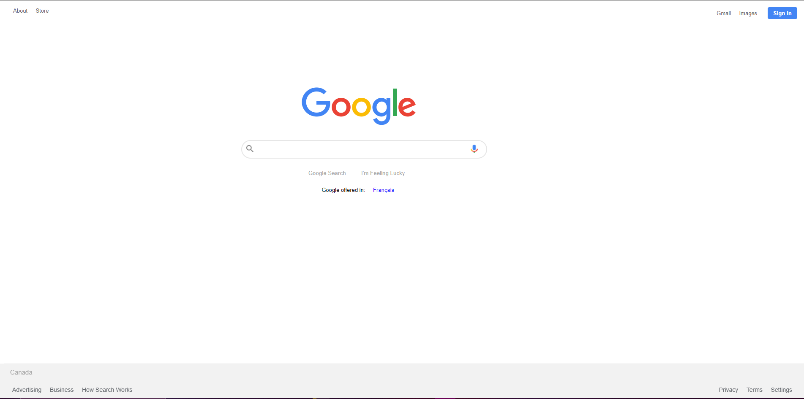
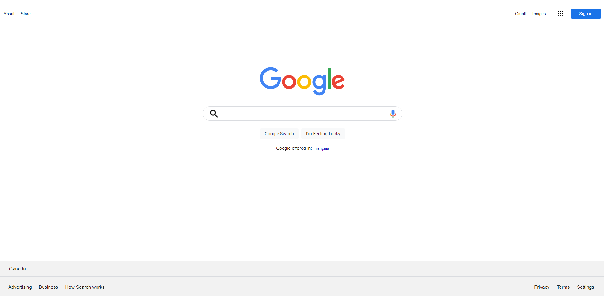

# GOOGLE CLONE<!-- omit in toc -->

## Version 2<!-- omit in toc -->

- **Project Start:** May 29, 2021
- **Project End:** May 29, 2021

# CONTENTS
- [CONTENTS](#contents)
  - [Introduction](#introduction)
  - [Version History](#version-history)
  - [Screenshots](#screenshots)
  - [Methodology](#methodology)
  - [Tools I Used](#tools-i-used)
  - [What I learned](#what-i-learned)
  - [Items for further study](#items-for-further-study)
  - [About me](#about-me)
 

Introduction
---
---

This is an attempt to recreate the desktop version of a non-functioning Google homepage when one isn't logged into their account.

Version History
---
---

**1.0 - first version! April 11, 2020**

This one is optimized for desktop. I did this one shortly after taking some tutorials following [The Odin Project](https://www.theodinproject.com/), as well as numerous other tutorials on YouTube.

No functiuonality (links don't go anywhere, and while you can type something in the searchbar, it wouldn't do anything).

Screenshots
---
---

**Version 2**

Methodology
---
---

After setting up the HTML markup, I styled it with CSS.

I did refer to the styles displayed on the homepage using Dev Tools when I was stumped.

Tools I Used
---
---

- HTML
- CSS
- Dev Tools (using Brave browser)

What I learned
---
---

It was pretty nice to use flex and grid to help me with positioning items on the page

Items for further study
---
---

For version 2, I'll work on making the mobile version of the homepage. Also, I would like to make the searchbar functional, so that whatever you type will actually search through Google and give back results.

In addition, I will look into making little tweaks here and there, such as getting the correct icons for the searchbar. Also, I want to get the Google Apps dropdown working.

About me
---
---

Thanks for checking out my mini project! You can find my profiles here:

- Frontend Mentor: [https://www.frontendmentor.io/profile/Infinity-Mineeva](https://www.frontendmentor.io/profile/Infinity-Mineeva)

